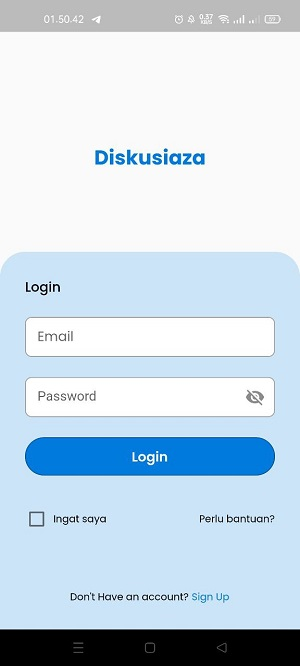
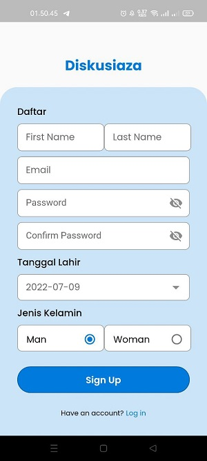

# Flutter-Diskusiaza

An FGD-themed mobile application where there are many users interacting in it. Using RESTful api sourced from https://capstone-go.dikatest.xyz/. This app is still under development.

## Link to download apk

https://bit.ly/diskuziaza

## Feature

This application offers an account feature, where to be able to use this application you must register first. Users can post, update, and delete the threads they create. In addition, users can also like/unlike every thread they encounter.

## Package used in

- google_fonts: ^3.0.1
- intl: ^0.17.0
- dio: ^4.0.6
- provider: ^6.0.3
- fluttertoast: ^8.0.9
- shared_preferences: ^2.0.15

## Some app screenshots

### LoginScreen

### RegisterScreen

### HomeScreen

### PostThreadModals

### ProfileScreen

### ProfileDetailScreen
